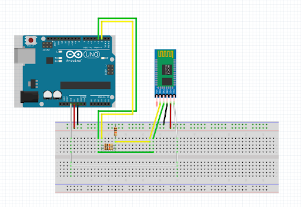

# International Space Station Tracker

This project utilzies a pyportal which is an internet-capable microcontroller with a built in screen. The code calls an API that actively tracks the space station position to yield a latitude and longitude coordinate pair which then was mapped to x-y coordinates on a mercator projection. It also tracks the path of the space station as it orbits the earth every 90 or so minutes. The greatest challenge I faced was getting acquainted with the Pyportal's libraries and capabilities which was overcome just by scouring the documentation :(

| **Engineer** | **School** | **Area of Interest** | **Grade** |
|:--:|:--:|:--:|:--:|
| Josh M | Cooper Union | Electrical Engineering | Incoming Junior |


  
# Final Milestone

I only complteded the base project and the modifications are left up to your discretion. All the modifications you made to the project are appropriate to share in the final milestone. checkout the modifications-ISS.md file in this directory for some suggestions!

<iframe width="485" height="862" src="https://www.youtube.com/embed/HKJfoPRewhY" title="BlueStamp Engineering International Space Station Tracker" frameborder="0" allow="accelerometer; autoplay; clipboard-write; encrypted-media; gyroscope; picture-in-picture; web-share" referrerpolicy="strict-origin-when-cross-origin" allowfullscreen></iframe>

For your final milestone, explain the outcome of your project. Key details to include are:
- What you've accomplished since your previous milestone
- What your biggest challenges and triumphs were at BSE
- A summary of key topics you learned about
- What you hope to learn in the future after everything you've learned at BSE


# Second Milestone

**Don't forget to replace the text below with the embedding for your milestone video. Go to Youtube, click Share -> Embed, and copy and paste the code to replace what's below.**

An example of a second milestone would be completing the base project, connecting it to the ISS position API and mapping that to coordinates on the pyportal screen.

<iframe width="1319" height="742" src="https://www.youtube.com/embed/11ZVHGhcsv8" title="Malachi J Milestone 1" frameborder="0" allow="accelerometer; autoplay; clipboard-write; encrypted-media; gyroscope; picture-in-picture; web-share" referrerpolicy="strict-origin-when-cross-origin" allowfullscreen></iframe>
For your second milestone, explain what you've worked on since your previous milestone. You can highlight:
- Technical details of what you've accomplished and how they contribute to the final goal
- What has been surprising about the project so far
- Previous challenges you faced that you overcame
- What needs to be completed before your final milestone 

# First Milestone

**Don't forget to replace the text below with the embedding for your milestone video. Go to Youtube, click Share -> Embed, and copy and paste the code to replace what's below.**

An example of a first milestone would be leaning to use the pyportal and how to connect it to the internet. Perhaps write a program that simply displays any information using an API like the time or weather.

<iframe width="560" height="315" src="https://www.youtube.com/embed/CaCazFBhYKs" title="YouTube video player" frameborder="0" allow="accelerometer; autoplay; clipboard-write; encrypted-media; gyroscope; picture-in-picture; web-share" allowfullscreen></iframe>

For your first milestone, describe what your project is and how you plan to build it. You can include:
- An explanation about the different components of your project and how they will all integrate together
- Technical progress you've made so far
- Challenges you're facing and solving in your future milestones
- What your plan is to complete your project

# Schematics 
Here's where you'll put images of your schematics. [Tinkercad](https://www.tinkercad.com/blog/official-guide-to-tinkercad-circuits) and [Fritzing](https://fritzing.org/learning/) are both great resoruces to create professional schematic diagrams, though BSE recommends Tinkercad becuase it can be done easily and for free in the browser. 



# Code
Here's where you'll put your code. The syntax below places it into a block of code. Follow the guide [here]([url](https://www.markdownguide.org/extended-syntax/)) to learn how to customize it to your project needs. 

Here is the main code.py executable:
```python
# Standard Python and CircuitPython libraries
import time
import math
import board
import displayio
from terminalio import FONT
from adafruit_pyportal import PyPortal
from adafruit_display_shapes.circle import Circle
from adafruit_display_text.label import Label

#--| USER CONFIG |--------------------------
MARK_SIZE = 10           # Radius of the red marker that shows ISS location
MARK_COLOR = 0xFF3030    # Color of the ISS marker (bright red)
MARK_THICKNESS = 5       # Thickness of the circle marker
TRAIL_LENGTH = 200       # Number of dots to keep as "trail" behind ISS
TRAIL_COLOR = 0xFFFF00   # Color of the trail (yellow)
DATE_COLOR = 0x111111    # Text color for the date (dark gray)
TIME_COLOR = 0x111111    # Text color for the time (dark gray)
LAT_MAX = 80             # Max latitude shown on the map (affects y-scaling)
UPDATE_RATE = 10         # How often (in seconds) to update ISS position
#-------------------------------------------

# API providing current ISS location
DATA_SOURCE = "http://api.open-notify.org/iss-now.json"
DATA_LOCATION = ["iss_position"]  # JSON path to extract ISS location

# Get screen size for calculations
WIDTH = board.DISPLAY.width
HEIGHT = board.DISPLAY.height

# Get current directory path (for loading local map image)
cwd = ("/"+__file__).rsplit('/', 1)[0]

# Initialize PyPortal with:
# - API URL
# - JSON path to data
# - Neopixel status LED
# - No font for data text
# - Background image map
pyportal = PyPortal(
    url=DATA_SOURCE,
    json_path=DATA_LOCATION,
    status_neopixel=board.NEOPIXEL,
    text_font=None,
    default_bg=cwd + "/map.bmp"
)

# Sync internal clock to internet time
pyportal.get_local_time()

# Setup static text labels for date and time at bottom of screen
date_label = Label(FONT, text="0000-00-00", color=DATE_COLOR, x=165, y=223)
time_label = Label(FONT, text="00:00:00", color=TIME_COLOR, x=240, y=223)
pyportal.splash.append(date_label)
pyportal.splash.append(time_label)

# Setup group for drawing the ISS trail (just yellow dots)
trail_bitmap = displayio.Bitmap(3, 3, 1)  # Small 3x3 dot
trail_palette = displayio.Palette(1)
trail_palette[0] = TRAIL_COLOR
trail = displayio.Group()
pyportal.splash.append(trail)

# Setup marker group for drawing the current ISS location as a red circle
marker = displayio.Group()
for r in range(MARK_SIZE - MARK_THICKNESS, MARK_SIZE):
    marker.append(Circle(0, 0, r, outline=MARK_COLOR))  # draw concentric circles
pyportal.splash.append(marker)

#convert latitude and longitude to screen coordinates
def get_location(width=WIDTH, height=HEIGHT):
    """Fetch current lat/lon, convert to (x, y) tuple scaled to width/height."""

    try:
        location = pyportal.fetch()  # Query the API
    except RuntimeError:
        return None, None  # On error, return invalid position

    # Extract and convert strings to floats
    lat = float(location["latitude"])   # -90 to 90
    lon = float(location["longitude"])  # -180 to 180

    # Apply scaling to fit our cropped Mercator projection
    lat *= 90 / LAT_MAX  # squash latitude into smaller range for the map

    # Convert lon/lat to x/y using Mercator projection
    x = (lon + 180) * (width / 360)

    y = math.radians(lat)
    y = math.tan(math.pi / 4 + y / 2)
    y = math.log(y)
    y = (width * y) / (2 * math.pi)
    y = height / 2 - y

    return int(x), int(y)

#draw location, trail, and update time
def update_display(current_time, update_iss=False):
    """Update the display with current info."""

    # Update ISS marker location and trail
    if update_iss:
        x, y = get_location()
        if x and y:
            marker.x = x
            marker.y = y
            # Add to trail (limit trail size)
            if len(trail) >= TRAIL_LENGTH:
                trail.pop(0)
            trail.append(displayio.TileGrid(
                trail_bitmap,
                pixel_shader=trail_palette,
                x = x - 1,
                y = y - 1
            ))

    # Update time and date labels
    date_label.text = "{:04}-{:02}-{:02}".format(current_time.tm_year,
                                                 current_time.tm_mon,
                                                 current_time.tm_mday)
    time_label.text = "{:02}:{:02}:{:02}".format(current_time.tm_hour,
                                                 current_time.tm_min,
                                                 current_time.tm_sec)

    # Attempt to refresh display
    try:
        board.DISPLAY.refresh(target_frames_per_second=60)
    except AttributeError:
        board.DISPLAY.refresh_soon()

#main loop to continuously update display
# Initial update before entering loop
update_display(time.localtime(), True)
last_update = time.monotonic()

# Forever loop: update time and ISS position every UPDATE_RATE .5 seconds
while True:
    now = time.monotonic()
    new_position = False
    if now - last_update > UPDATE_RATE:
        new_position = True
        last_update = now
    update_display(time.localtime(), new_position)
    time.sleep(0.5)

```
Here is the settings.toml file necessary to connect to the internet:
```python
CIRCUITPY_WIFI_SSID = "your wifi SSID"
CIRCUITPY_WIFI_PASSWORD = "your wifi password"
#create an adafruit IO account to get a username and key
ADAFRUIT_AIO_USERNAME = "your adafruit IO account username"
ADAFRUIT_AIO_KEY = "your adafruit IO key that's associated with your account"
```

# Bill of Materials
Here's where you'll list the parts in your project. To add more rows, just copy and paste the example rows below.
Don't forget to place the link of where to buy each component inside the quotation marks in the corresponding row after href =. Follow the guide [here]([url](https://www.markdownguide.org/extended-syntax/)) to learn how to customize this to your project needs. 

| **Part** | **Note** | **Price** | **Link** |
|:--:|:--:|:--:|:--:|
| Adafruit Pyportal | Microcontroller and screen | $54.95 | <a href="https://www.adafruit.com/product/4116"> Malachi </a> |
| Micro USB Cable | Connect computer to pyportal | $4.95 | <a href="https://www.adafruit.com/product/592"> Link </a> |

# Other Resources/Examples
Here is a <a href="https://docs.circuitpython.org/projects/pyportal/en/latest/api.html"> link </a> to the documentation for the standard Pyportal library to help get you started.

To watch the BSE tutorial on how to create a portfolio, click <a href="https://drive.google.com/file/d/1GIGxyskToY8Ep137GnfTcfMCH4LaB6MF/view"> here </a>.
