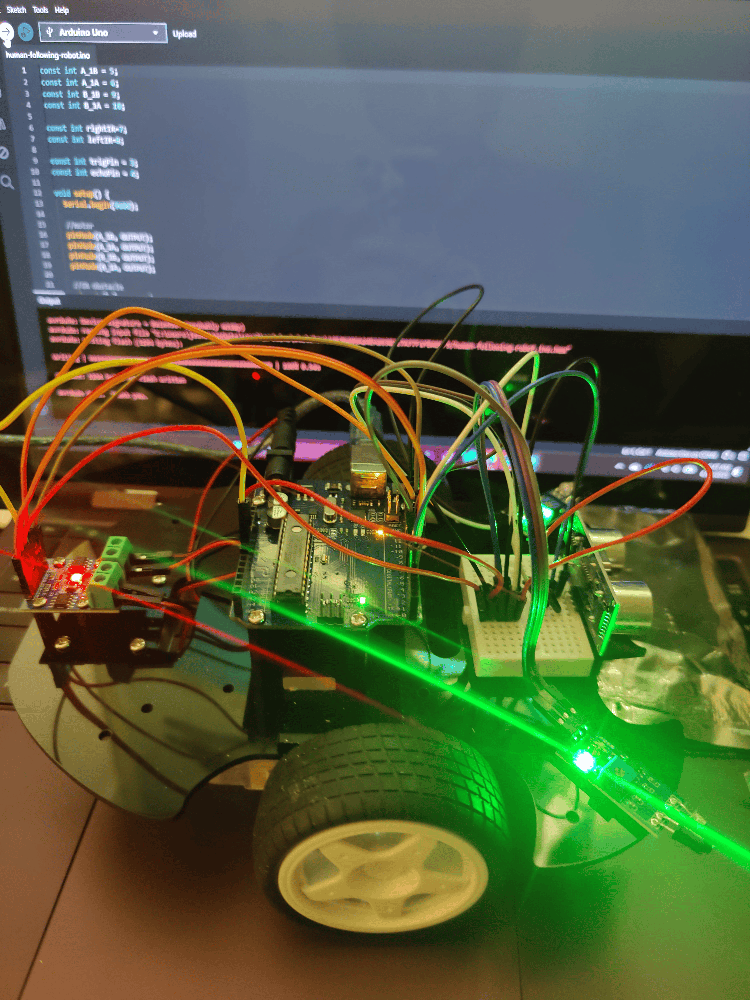
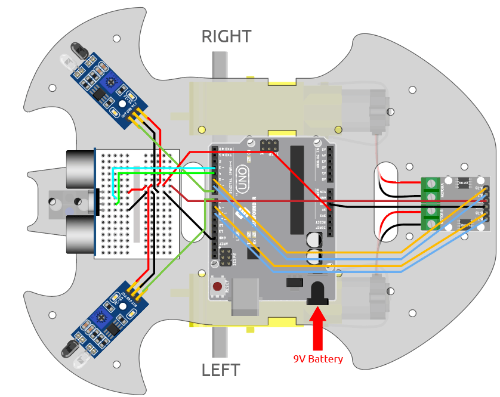

# Human-Following Robot


This project detects the position of a human hand(or any IR reflecting object) relative to the car and orients itself to face the hand and move towards it. It Uses and Ultrasonic sensor to detect objects in front and a pair of IR sensors to detect objects at the side. The car was constructed from an acryllic frame, 2 motors driving a pair of wheels, and a universal wheel. An L9110S motor driver was used to couple the 2 driving motors. 

| **Engineer** | **School** | **Area of Interest** | **Grade** |
|:--:|:--:|:--:|:--:|
| Josh M| Cooper Union | Electrical Engineering | Incoming Junior |

**Replace the BlueStamp logo below with an image of yourself and your completed project. Follow the guide [here](https://tomcam.github.io/least-github-pages/adding-images-github-pages-site.html) if you need help.**


  
# Final Milestone
**Don't forget to replace the text below with the embedding for your milestone video. Go to Youtube, click Share -> Embed, and copy and paste the code to replace what's below.**

I only completed the base project but an example of a final milestone would be the modifications you make to the project. Checkout the modifications.md file in this repository for some suggestions!

<iframe width="474" height="843" src="https://www.youtube.com/embed/N6S5iMMxFXY" title="BlueStamp Human Following Robot Video" frameborder="0" allow="accelerometer; autoplay; clipboard-write; encrypted-media; gyroscope; picture-in-picture; web-share" referrerpolicy="strict-origin-when-cross-origin" allowfullscreen></iframe>

For your final milestone, explain the outcome of your project. Key details to include are:
- What you've accomplished since your previous milestone
- What your biggest challenges and triumphs were at BSE
- A summary of key topics you learned about
- What you hope to learn in the future after everything you've learned at BSE


# Second Milestone

**Don't forget to replace the text below with the embedding for your milestone video. Go to Youtube, click Share -> Embed, and copy and paste the code to replace what's below.**

An example of a realistiic second milestone is successfully implementing all of the sensors and the motor driver to detect your hand and move towards it.

<iframe width="560" height="315" src="https://www.youtube.com/embed/y3VAmNlER5Y" title="YouTube video player" frameborder="0" allow="accelerometer; autoplay; clipboard-write; encrypted-media; gyroscope; picture-in-picture; web-share" allowfullscreen></iframe>

For your second milestone, explain what you've worked on since your previous milestone. You can highlight:
- Technical details of what you've accomplished and how they contribute to the final goal
- What has been surprising about the project so far
- Previous challenges you faced that you overcame
- What needs to be completed before your final milestone 

# First Milestone

**Don't forget to replace the text below with the embedding for your milestone video. Go to Youtube, click Share -> Embed, and copy and paste the code to replace what's below.**

Since this is just a demo portfolio, I didn't complete any milestones but an example of a first milestone would be constructing the frame and writing some code to get the motors to move the car. However, this can be tailored to you. Embed a youtube video and fill out a description under the youtube video.

<iframe width="560" height="315" src="https://www.youtube.com/embed/CaCazFBhYKs" title="YouTube video player" frameborder="0" allow="accelerometer; autoplay; clipboard-write; encrypted-media; gyroscope; picture-in-picture; web-share" allowfullscreen></iframe>

For your first milestone, describe what your project is and how you plan to build it. You can include:
- An explanation about the different components of your project and how they will all integrate together
- Technical progress you've made so far
- Challenges you're facing and solving in your future milestones
- What your plan is to complete your project

# Schematics 
Here's where you'll put images of your schematics. [Tinkercad](https://www.tinkercad.com/blog/official-guide-to-tinkercad-circuits) and [Fritzing](https://fritzing.org/learning/) are both great resoruces to create professional schematic diagrams, though BSE recommends Tinkercad becuase it can be done easily and for free in the browser. 



# Code 
Here's where you'll put your code. The syntax below places it into a block of code. Follow the guide [here]([url](https://www.markdownguide.org/extended-syntax/)) to learn how to customize it to your project needs. 

```c++
#include <SoftwareSerial.h>
SoftwareSerial BT_Serial(2, 3); // RX, TX

/*
L9110S:
Motor A: IA1 = in1 (e.g. pin 9), IB1 = in2 (e.g. pin 8)
Motor B: IA2 = in3 (e.g. pin 7), IB2 = in4 (e.g. pin 6)
*/

#define in1 9 // Motor A input 1 (Right motor forward)
#define in2 8 // Motor A input 2 (Right motor backward)
#define in3 7 // Motor B input 1 (Left motor backward)
#define in4 6 // Motor B input 2 (Left motor forward)

char bt_data; // Variable to receive data from Bluetooth
int Speed = 150; // PWM value (0–255)

void setup() {
  Serial.begin(9600);
  BT_Serial.begin(9600);

  pinMode(in1, OUTPUT);
  pinMode(in2, OUTPUT);
  pinMode(in3, OUTPUT);
  pinMode(in4, OUTPUT);

  delay(200);
}

void loop() {
  if (BT_Serial.available() > 0) {
    bt_data = BT_Serial.read();
    Serial.println(bt_data);
  }

  if (bt_data == 'f') {
    forward();
    Speed = 180;
  }
  else if (bt_data == 'b') {
    backward();
    Speed = 180;
  }
  else if (bt_data == 'l') {
    turnLeft();
    Speed = 250;
  }
  else if (bt_data == 'r') {
    turnRight();
    Speed = 250;
  }
  else if (bt_data == 's') {
    Stop();
    Speed = 0;
  }
}

void forward() {
  analogWrite(in1, Speed);
  analogWrite(in2, 0);
  analogWrite(in3, 0);
  analogWrite(in4, Speed);
}

void backward() {
  analogWrite(in1, 0);
  analogWrite(in2, Speed);
  analogWrite(in3, Speed);
  analogWrite(in4, 0);
}

void turnRight() {
  analogWrite(in1, 0);
  analogWrite(in2, Speed);
  analogWrite(in3, 0);
  analogWrite(in4, Speed);
}

void turnLeft() {
  analogWrite(in1, Speed);
  analogWrite(in2, 0);
  analogWrite(in3, Speed);
  analogWrite(in4, 0);
}

void Stop() {
  analogWrite(in1, 0);
  analogWrite(in2, 0);
  analogWrite(in3, 0);
  analogWrite(in4, 0);
}

```

# Bill of Materials
Here's where you'll list the parts in your project. To add more rows, just copy and paste the example rows below.
Don't forget to place the link of where to buy each component inside the quotation marks in the corresponding row after href =. Follow the guide [here]([url](https://www.markdownguide.org/extended-syntax/)) to learn how to customize this to your project needs. 

| **Part** | **Note** | **Price** | **Link** |
|:--:|:--:|:--:|:--:|
| Sunfounder 3-in-1 kit | Contains all items in biuld | $60 | <a href="https://www.amazon.com/SunFounder-Compatible-Tutorials-Including-Controller/dp/B0B778L1DZ/ref=sr_1_4?dib=eyJ2IjoiMSJ9.D9LrCZJnua_keVMLJz2FWndaKBvfLliNkX8pEpx-M5ocxl66rlIHHNxPx934jXYwNUopVM4uYhSLr4r6klPaljdv30IDsPEyrO7TVbLN0ac.S2vkH-CFKxogVOVkIbW92XUBWpqqOinX4PYbdsYGjcM&dib_tag=se&keywords=sunfounder+3+in+1+starter+kit&qid=1748096711&sr=8-4"> Link </a> |

# Other Resources/Examples
One of the best parts about Github is that you can view how other people set up their own work. Here are some past BSE portfolios that are awesome examples. You can view how they set up their portfolio, and you can view their index.md files to understand how they implemented different portfolio components.
- [Example 1](https://trashytuber.github.io/YimingJiaBlueStamp/)
- [Example 2](https://sviatil0.github.io/Sviatoslav_BSE/)
- [Example 3](https://arneshkumar.github.io/arneshbluestamp/)

To watch the BSE tutorial on how to create a portfolio, click <a href="https://drive.google.com/file/d/1GIGxyskToY8Ep137GnfTcfMCH4LaB6MF/view"> here </a>.
