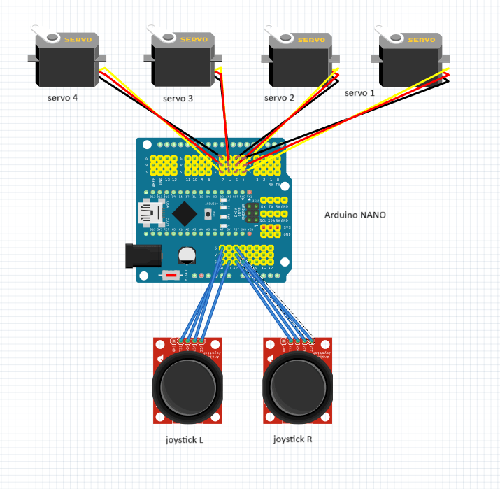

# Three-Joint Robotic Arm
This project features a ustom robotic arm with a gripper. A quartet of servos that individually control an axis of motion for the robotic arm. A controller with 2 analog sticks cosntructed from potentiometers control the movement of the servos. 

You should comment out all portions of your portfolio that you have not completed yet, as well as any instructions:
```HTML 
<!--- This is an HTML comment in Markdown -->
<!--- Anything between these symbols will not render on the published site -->
```

| **Engineer** | **School** | **Area of Interest** | **Grade** |
|:--:|:--:|:--:|:--:|
| Josh M | Cooper Union | Electrical Engineering | Incoming Junior |

**Replace the BlueStamp logo below with an image of yourself and your completed project. Follow the guide [here](https://tomcam.github.io/least-github-pages/adding-images-github-pages-site.html) if you need help.**


  
# Final Milestone

**Don't forget to replace the text below with the embedding for your milestone video. Go to Youtube, click Share -> Embed, and copy and paste the code to replace what's below.**

I only completed the base project but the final milestone should show off all of the cool modifications you did to your arm. Some modification suggestions can be found in the modifications.md file in this directory.

<iframe width="1319" height="742" src="https://www.youtube.com/embed/QUYMb4puTQo" title="Coby L  Milestone 1" frameborder="0" allow="accelerometer; autoplay; clipboard-write; encrypted-media; gyroscope; picture-in-picture; web-share" referrerpolicy="strict-origin-when-cross-origin" allowfullscreen></iframe>

For your final milestone, explain the outcome of your project. Key details to include are:
- What you've accomplished since your previous milestone
- What your biggest challenges and triumphs were at BSE
- A summary of key topics you learned about
- What you hope to learn in the future after everything you've learned at BSE


# Second Milestone

**Don't forget to replace the text below with the embedding for your milestone video. Go to Youtube, click Share -> Embed, and copy and paste the code to replace what's below.**

An exmple of a second milestone is completing the base project, showign off the integration between the potentiometers and the servos to control each servo of the arm. demonstrate picking somethign up perhaps and how that reqeuirs a tigh connection beteween eaceh "joint" of the arm.

<iframe width="560" height="315" src="https://www.youtube.com/embed/y3VAmNlER5Y" title="YouTube video player" frameborder="0" allow="accelerometer; autoplay; clipboard-write; encrypted-media; gyroscope; picture-in-picture; web-share" allowfullscreen></iframe>

For your second milestone, explain what you've worked on since your previous milestone. You can highlight:
- Technical details of what you've accomplished and how they contribute to the final goal
- What has been surprising about the project so far
- Previous challenges you faced that you overcame
- What needs to be completed before your final milestone 

# First Milestone

**Don't forget to replace the text below with the embedding for your milestone video. Go to Youtube, click Share -> Embed, and copy and paste the code to replace what's below.**

An example of a first milestone is demonstrating the funcitonality of the servos and potentiometers by writing Arduino code to output a change in position that you set, or read inputs from the potentiometers, respectively. Additionally, you could also show off the phyiscal construction of the arm and talk about how the servos allow for one axis of motions and how they connect to form a single robotic arm. Maybe draw parallels to a human arm. 

<iframe width="560" height="315" src="https://www.youtube.com/embed/CaCazFBhYKs" title="YouTube video player" frameborder="0" allow="accelerometer; autoplay; clipboard-write; encrypted-media; gyroscope; picture-in-picture; web-share" allowfullscreen></iframe>

For your first milestone, describe what your project is and how you plan to build it. You can include:
- An explanation about the different components of your project and how they will all integrate together
- Technical progress you've made so far
- Challenges you're facing and solving in your future milestones
- What your plan is to complete your project

# Schematics 
Here's where you'll put images of your schematics. [Tinkercad](https://www.tinkercad.com/blog/official-guide-to-tinkercad-circuits) and [Fritzing](https://fritzing.org/learning/) are both great resoruces to create professional schematic diagrams, though BSE recommends Tinkercad becuase it can be done easily and for free in the browser. 

Here is a sample schematic that uses lithium batteries instead of a 9V alkaline.



# Code
Here's where you'll put your code. The syntax below places it into a block of code. Follow the guide [here]([url](https://www.markdownguide.org/extended-syntax/)) to learn how to customize it to your project needs. 

```c++
/*
 * Through this link you can download the source code:
 * https://github.com/Cokoino/CKK0006
 *                                     ________
 *                         ----|servo4| 
 *                        |            --------
 *                    |servo3|   
 *                        |
 *                        |
 *                    |servo2|
 *                        |
 *                        |
 *                  ___________
 *                  |  servo1 |
 *         ____________________
 *         ____________________
 * Functions:
 * arm.servo1.read();   //read the servo of angle
 * arm.servo2.read();
 * arm.servo3.read();
 * arm.servo4.read();
 * 
 * arm.servo1.write(angle);   //servo run
 * arm.servo2.write(angle);
 * arm.servo3.write(angle);
 * arm.servo4.write(angle);
 * 
 * arm.left(speed);    //perform the action 
 * arm.right(speed);
 * arm.up(speed);
 * arm.down(speed);
 * arm.open(speed);
 * arm.close(speed);
 * 
 * arm.captureAction();    //capture the current action,return pointer array
 * arm.do_action(int *p,int speed);  //P is a pointer to the array
 * 
 * arm.JoyStickL.read_x(); //Returns joystick numerical
 * arm.JoyStickL.read_y();
 * arm.JoyStickR.read_x();
 * arm.JoyStickR.read_y();
 */

/*
 * This code controls a 4-servo robotic arm with two joysticks and a buzzer.
 * - The joysticks move the arm (up/down, left/right) and open/close the gripper.
 * - You can record a series of movements ("actions") and play them back.
 */

#include "src/CokoinoArm.h" // Library for controlling the robotic arm
#define buzzerPin 9         // Buzzer pin connected to digital pin 9

CokoinoArm arm; // Create an instance of the robotic arm

// Variables to hold joystick positions
int xL, yL, xR, yR;

const int act_max = 170;      // Maximum number of recorded actions(170 is max memory)
int act[act_max][4];          // Stores recorded servo angles (4 servos per action)
int num = 0, num_do = 0;      // Index for recorded actions and playback

///////////////////////////////////////////////////////////////
void turnUD(void) { //move arm forwards/backwards base on left joystick vertical-axis
  if (xL != 512) { // 512 is the joystick center
    if (0 <= xL && xL <= 100) { arm.up(10); return; }
    if (900 < xL && xL <= 1024) { arm.down(10); return; }
    if (100 < xL && xL <= 200) { arm.up(20); return; }
    if (800 < xL && xL <= 900) { arm.down(20); return; }
    if (200 < xL && xL <= 300) { arm.up(25); return; }
    if (700 < xL && xL <= 800) { arm.down(25); return; }
    if (300 < xL && xL <= 400) { arm.up(30); return; }
    if (600 < xL && xL <= 700) { arm.down(30); return; }
    if (400 < xL && xL <= 480) { arm.up(35); return; }
    if (540 < xL && xL <= 600) { arm.down(35); return; }
  }
}

///////////////////////////////////////////////////////////////
void turnLR(void){ //rotates arm left/right based on left joystick horizontal-axis
  if(yL!=512){
    if(0<=yL && yL<=100){arm.right(0);return;}
    if(900<yL && yL<=1024){arm.left(0);return;}  
    if(100<yL && yL<=200){arm.right(5);return;}
    if(800<yL && yL<=900){arm.left(5);return;}
    if(200<yL && yL<=300){arm.right(10);return;}
    if(700<yL && yL<=800){arm.left(10);return;}
    if(300<yL && yL<=400){arm.right(15);return;}
    if(600<yL && yL<=700){arm.left(15);return;}
    if(400<yL && yL<=480){arm.right(20);return;}
    if(540<yL && yL<=600){arm.left(20);return;}
  }
}
///////////////////////////////////////////////////////////////
void turnCO(void){ //Open/close the gripper based on the right joystick vertical-axis
  if(xR!=512){
    if(0<=xR && xR<=100){arm.close(0);return;}
    if(900<xR && xR<=1024){arm.open(0);return;} 
    if(100<xR && xR<=200){arm.close(5);return;}
    if(800<xR && xR<=900){arm.open(5);return;}
    if(200<xR && xR<=300){arm.close(10);return;}
    if(700<xR && xR<=800){arm.open(10);return;}
    if(300<xR && xR<=400){arm.close(15);return;}
    if(600<xR && xR<=700){arm.open(15);return;}
    if(400<xR && xR<=480){arm.close(20);return;}
    if(540<xR && xR<=600){arm.open(20);return;} 
    }
}
///////////////////////////////////////////////////////////////
void date_processing(int *x,int *y){ //cancel movement of one axis if movement is stronger in another
  if(abs(512-*x)>abs(512-*y))
    {*y = 512;}
  else
    {*x = 512;}
}
///////////////////////////////////////////////////////////////
//sound buzzer to indicate actions are being recorded and stop once its finished recoring
void buzzer(int H, int L) {
  // While pushing joystick down
  while (yR < 420) {
    digitalWrite(buzzerPin, HIGH);
    delayMicroseconds(H);
    digitalWrite(buzzerPin, LOW);
    delayMicroseconds(L);
    yR = arm.JoyStickR.read_y(); // Update value
  }

  // While pushing joystick up
  while (yR > 600) {
    digitalWrite(buzzerPin, HIGH);
    delayMicroseconds(H);
    digitalWrite(buzzerPin, LOW);
    delayMicroseconds(L);
    yR = arm.JoyStickR.read_y();
  }
}

///////////////////////////////////////////////////////////////
//capture the current arm position into the action memory(up to 170, changeable in const int act_max)
//push the right josytick to the left to start recording 
void C_action(void) {
  if (yR > 800) { // 
    int *p;
    p = arm.captureAction(); // Returns pointer to 4 servo angles
    // Store each angle in act array
    for (char i = 0; i < 4; i++) {
      act[num][i] = *p;
      p = p + 1;
    }
    num++;       // Advance storage index
    num_do = num;
    if (num >= act_max) {
      num = 0;   // Reset if max reached
      buzzer(600, 400);
    }
    while (yR > 600) {
      yR = arm.JoyStickR.read_y(); // Wait for release
    }
  }
}

///////////////////////////////////////////////////////////////
//Playback all stored movements sequentially by pushing right joystick to the right
void Do_action(void) {
  if (yR < 220) { 
    buzzer(200, 300);
    for (int i = 0; i < num_do; i++) {
      arm.do_action(act[i], 15); // Execute each recorded position
    }
    num = 0; // Reset recorded actions
    while (yR < 420) {
      yR = arm.JoyStickR.read_y(); // Wait for release
    }
    // Finish with buzzer tone
    for (int i = 0; i < 2000; i++) {
      digitalWrite(buzzerPin, HIGH);
      delayMicroseconds(200);
      digitalWrite(buzzerPin, LOW);
      delayMicroseconds(300);
    }
  }
}

///////////////////////////////////////////////////////////////
void setup() {
  //Serial.begin(9600);
  //arm of servo motor connection pins
  arm.ServoAttach(4,5,6,7);
  //arm of joy stick connection pins : xL,yL,xR,yR
  arm.JoyStickAttach(A0,A1,A2,A3);
  pinMode(buzzerPin,OUTPUT);
}
///////////////////////////////////////////////////////////////
//loop continunously to read joystick inputs
void loop() {
  // Read joystick positions
  xL = arm.JoyStickL.read_x();
  yL = arm.JoyStickL.read_y();
  xR = arm.JoyStickR.read_x();
  yR = arm.JoyStickR.read_y();

  // Filter out diagonal inputs
  date_processing(&xL, &yL);
  date_processing(&xR, &yR);

  // Move based on joystick input
  turnUD();      // Up/Down control
  turnLR();      // Left/Right control
  turnCO();      // Open/Close gripper
  C_action();    // Save position
  Do_action();   // Play saved motions
}
```

# Bill of Materials
Here's where you'll list the parts in your project. To add more rows, just copy and paste the example rows below.
Don't forget to place the link of where to buy each component inside the quotation marks in the corresponding row after href =. Follow the guide [here]([url](https://www.markdownguide.org/extended-syntax/)) to learn how to customize this to your project needs. 

| **Part** | **Note** | **Price** | **Link** |
|:--:|:--:|:--:|:--:|
| Robot arm kit | Contains physical components of the arm | $45 | <a href="https://www.amazon.com/LK-COKOINO-Compliment-Engineering-Technology/dp/B081FG1JQ1"> Link </a> |
| Servo Shield | expansion shield for microcontroller | $11 | <a href="https://www.amazon.com/HiLetgo-Expansion-Sensor-Arduino-Duemilanove/dp/B07VQRCC8F/ref=sr_1_1_sspa?crid=IY8280UJPZ8D&dib=eyJ2IjoiMSJ9.gOnvWbSP2fpJyjlzThZoFsFPHoeaF2QpSk_jNdngKIr1twGn_LzcDoaoxYvFyCU-mVjs0xm0675XcM9jJCRLlzDOmjbGgP1sIqUhTjt4NviT5cbtoA-UvEYAIHWDWIfkb2aFMmhgHU544Wc7YJiipzzt3fuSGamCrVeh0ONFUE7GqEzOyVIpGdjm_kZqEYrk4l6Ol054nebh1I2eZg7hcYRPAX8iNqbzSBQnTX3EaUY.ewdYdtnT9O7qRCuhV_2P0vAhp7a5Ue2sdk1REW8_gKI&dib_tag=se&keywords=arduino+nano+servo+shield&qid=1716857827&s=toys-and-games&sprefix=arduino+nano+servo+shield%2Ctoys-and-games%2C85&sr=1-1-spons&sp_csd=d2lkZ2V0TmFtZT1zcF9hdGY&psc=1"> Link </a> |
| Screwdriver kit | Aide in the assmebly of the arm | $6 | <a href="https://www.amazon.com/Small-Screwdriver-Set-Mini-Magnetic/dp/B08RYXKJW9/"> Link </a> |
| Electronics kit | Contains components and wires for modifications | $14 | <a href="https://www.amazon.com/Smraza-Electronics-Potentiometer-tie-Points-Breadboard/dp/B0B62RL725/ref=sxts_b2b_sx_reorder_acb_business?content-id=amzn1.sym.f63a3b0b-3a29-4a8e-8430-073528fe007f%3Aamzn1.sym.f63a3b0b-3a29-4a8e-8430-073528fe007f&crid=2IC3T44H3U3WG&cv_ct_cx=breadboard+kit&dib=eyJ2IjoiMSJ9.TUd5tu2T8rmms7ZuJ0UzmbtpLL1zsu93bQM0PzwnP4E.sT0V0vL_QtbYv8ymVTCcRkhFNgBtRvRiT7G4FT1oGTE&dib_tag=se&keywords=breadboard+kit&pd_rd_i=B0B62RL725&pd_rd_r=67e1f4ff-e3b9-44e4-b441-b4ae282f036b&pd_rd_w=UjFaP&pd_rd_wg=0xRoC&pf_rd_p=f63a3b0b-3a29-4a8e-8430-073528fe007f&pf_rd_r=BFGP77H27ZN31W4PZAW6&qid=1715911733&sbo=RZvfv%2F%2FHxDF%2BO5021pAnSA%3D%3D&sprefix=breadboard+kit%2Caps%2C109&sr=1-2-9f062ed5-8905-4cb9-ad7c-6ce62808241a"> Link </a> |
| 9v barrel jack | Allows 9v alkaline battery to power | $6 | <a href="https://www.amazon.com/DZS-Elec-Connector-Experimental-5-5x2-1mm/dp/B07FDS11ZY/ref=sr_1_5?crid=2KDQRHR9QTG87&dib=eyJ2IjoiMSJ9.QXzrFs_APhSZ1IJhcXZvMQHwewvRuQ3vr1brQtDco3W0bnAprDG7jH7ie8dBlokDPWbOLcDtgbrHrNUzcyb61YgxbGO0UFeN6K8ktLZDkV3jlxoO940ZYOk8jrd3G8yxrkH-cUJgXaiOka1FWDDJJssGcdvyH2WlPRHUtZKQgBpoGa4M3j8wwx3yssPZrOJK32Pfs9ZLtCibGXHxhNbXOBuXOisFlpDByQ2NJcndu5iOa0dZ8jknYgybT1KOyzP9_lSVyQNCkcxcjanEjyf4Z6jMdRX-G08K6SY7IM-agSA.UzM8eWF_dtBmatnqwrbt1mCm8-reUmM7Mqm3SWpbviM&dib_tag=se&keywords=9v+to+barrel+jack&qid=1716857906&s=electronics&sprefix=9v+to+barrel+jack%2Celectronics%2C98&sr=1-5"> Link </a> |
| digital multimeter | Aids in debugging | $11 | <a href="https://www.amazon.com/AstroAI-Digital-Multimeter-Voltage-Tester/dp/B01ISAMUA6/ref=sxin_17_pa_sp_search_thematic_sspa?content-id=amzn1.sym.e8da13fc-7baf-46c3-926a-e7e8f63a520b%3Aamzn1.sym.e8da13fc-7baf-46c3-926a-e7e8f63a520b&cv_ct_cx=digital+multimeter&dib=eyJ2IjoiMSJ9.5LQumrfBR8l0mKnJCJlRg73dxpou0gqYD_ffU3srgs0Utegwth8GcQCSVXVzeZeLSJx5J3itz5TLdmJHsrVITQ.-00jRPoT-bBy26YC4LzQ-S4cYdztgmSMGb83_WEm6HY&dib_tag=se&keywords=digital+multimeter&pd_rd_i=B01ISAMUA6&pd_rd_r=e1ff2570-7e4a-4906-bc55-6f819d48d1bc&pd_rd_w=h7HgL&pd_rd_wg=0ZcFH&pf_rd_p=e8da13fc-7baf-46c3-926a-e7e8f63a520b&pf_rd_r=R6YKX3NXTDQ1PQP4H8RM&qid=1715911879&sbo=RZvfv%2F%2FHxDF%2BO5021pAnSA%3D%3D&sr=1-1-7efdef4d-9875-47e1-927f-8c2c1c47ed49-spons&sp_csd=d2lkZ2V0TmFtZT1zcF9zZWFyY2hfdGhlbWF0aWM&psc=1"> Link </a> |
| 9v batteries | Powers arm and microcontroller | $12 | <a href="https://www.amazon.com/dp/B00MH4QM1S/ref=vp_d_pb_TIER4_cml_lp_B0BJ26CHZB_pd?_encoding=UTF8&pf_rd_p=b8d9960f-63a9-4d69-a8de-de9514a27e41&pf_rd_r=1RRARBM9YNNHR89D8B2N&pd_rd_wg=FwKYY&pd_rd_i=B00MH4QM1S&pd_rd_w=XrNnI&content-id=amzn1.sym.b8d9960f-63a9-4d69-a8de-de9514a27e41&pd_rd_r=edb0610d-b8f5-4671-814f-f6cb22938f22&th=1"> Link </a> |

# Other Resources/Examples
One of the best parts about Github is that you can view how other people set up their own work. Here are some past BSE portfolios that are awesome examples. You can view how they set up their portfolio, and you can view their index.md files to understand how they implemented different portfolio components.
- [Example 1](https://trashytuber.github.io/YimingJiaBlueStamp/)
- [Example 2](https://sviatil0.github.io/Sviatoslav_BSE/)
- [Example 3](https://arneshkumar.github.io/arneshbluestamp/)

To watch the BSE tutorial on how to create a portfolio, click here.
